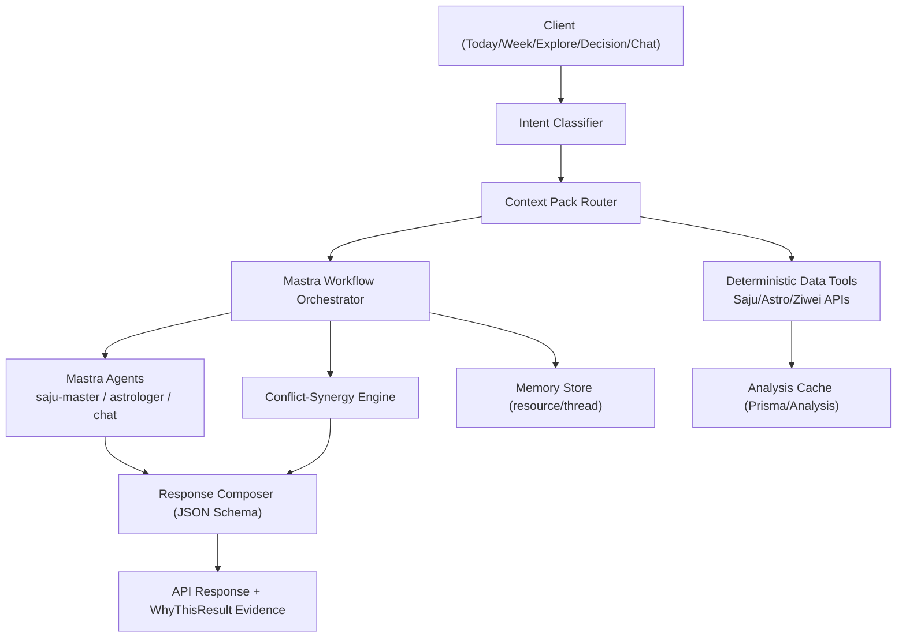

# 탐색 페이지 데이터 인벤토리

> 생년월일시 + 위치(위경도) 입력 기준으로 사주·점성술 시스템이 산출할 수 있는 모든 데이터를 정리한 문서.
> 작성일: 2026-03-05

---

## 1. 사주(四柱)로 얻을 수 있는 기초 정보

| # | 데이터 | 메서드/소스 | 내용 | 변화 주기 |
|---|---|---|---|---|
| 1-1 | **사주 4기둥** (년·월·일·시) | `FortuneTellerService.calculateSaju()` → `sajuData.pillars.{년,월,일,시}` | 각 기둥의 천간·지지·오행(천간/지지) | **고정** (출생 시 결정) |
| 1-2 | **십이운성** (12운성) | ↑ `pillar.십이운성` | 각 기둥별 생·욕·대·관·왕·쇠·병·사·묘·절·태·양 | **고정** |
| 1-3 | **지장간** (藏干) | ↑ `pillar.지장간[]` | 각 지지 안에 숨어있는 천간 + 해당 십신 | **고정** |
| 1-4 | **신살** (神煞) | ↑ `pillar.신살[]` | 도화살·역마살·화개살·귀문관살 등 | **고정** |
| 1-5 | **십신 분포** | `sipsinCalculator.analyzeSipsin()` → `sipsin.counts`, `sipsin.dominant_sipsin` | 비겁·식상·재성·관성·인성 각각의 개수 + 주요 십신 | **고정** |
| 1-6 | **십신 위치** | ↑ `sipsin.positions` | 년간·월간·시간·년지·월지·일지·시지 각각의 십신 | **고정** |
| 1-7 | **오행 파워** | `SinyakSingangAnalyzer.analyzeSinyakSingang()` → `element_powers` | 목·화·토·금·수 각각의 수치 | **고정** |
| 1-8 | **신강/신약** | ↑ `strength_type`, `strength_score` | 일간의 강/약 판정 + 점수 | **고정** |
| 1-9 | **형충파해** | `calculateHyungchung()` → `HyungchungResult` | 삼합, 천간합, 삼형살, 자형살, 육충살, 육파살, 육해살 | **고정** |
| 1-10 | **대운** (10년 주기) | `sipsinCalculator.calculateGreatFortune()` → `greatFortune.periods[]` | 각 대운의 시작/종료 나이, 천간·지지·십신 | **10년** 단위 변화 |
| 1-11 | **현재 대운** | ↑ `greatFortune.current_period` | 지금 해당하는 대운 기둥 + 십신 | **10년** |

---

## 2. 점성술(Astrology)로 얻을 수 있는 기초 정보

| # | 데이터 | 메서드/엔드포인트 | 내용 | 변화 주기 |
|---|---|---|---|---|
| 2-1 | **행성 위치** (7개) | `/api/astrology/static` → `positions[planet]` | 각 행성의 황경(lonDeg), 별자리(sign), 별자리 내 도수, 하우스 | ☉ **일**, ☽ **2.5일**, 내행성 **주~월**, 외행성 **월~년** |
| 2-2 | **어스펙트** (행성 간 각도) | `/api/astrology/aspects` → `aspects[]` | 두 행성의 합·충·삼합·사각·육각 + 오브(허용도) + applying 여부 | **일~주** |
| 2-3 | **ASC (상승점)** | `/api/astrology/chart-core` → `ascendant` | 동쪽 수평선 별자리 + 도수 | **고정** (출생 시) |
| 2-4 | **MC (중천)** | ↑ `midheaven` | 천정 별자리 + 도수 | **고정** |
| 2-5 | **12 하우스 배치** | ↑ `houses[]` | 각 하우스의 경계(cusp) 도수 + 별자리 | **고정** |
| 2-6 | **행성-하우스 배치** | ↑ `planets[id].house` | 각 행성이 어느 하우스에 위치하는지 | **고정** |
| 2-7 | **낙샤트라** (Vedic) | `/api/astrology/vedic-core` → `planets[id].nakshatra` | 각 행성의 낙샤트라 이름·파다·지배성·도수 | ☽ **일**, 기타 **주~년** |
| 2-8 | **달의 낙샤트라** | ↑ `moonNakshatra` | 달의 낙샤트라 (출생 시 + 트랜짓) | **일** (트랜짓 시) |
| 2-9 | **항성 황경 (Sidereal)** | ↑ `planets[id].siderealLonDeg` | 아야남사 보정된 실제 항성 좌표 | 행성별 상이 |
| 2-10 | **아야남사** | ↑ `ayanamsa` | 트로피컬↔사이드리얼 보정값 (Lahiri/Fagan-Bradley/KP) | **년** |
| 2-11 | **주야 차트 (isDayChart)** | `/api/astrology/static` → `isDayChart` | 태양이 수평선 위인지 여부 | **고정** |

---

## 3. 사주의 기초 정보로 얻을 수 있는 복합/해설 정보

| # | 데이터 | 메서드/소스 | 내용 | 변화 주기 |
|---|---|---|---|---|
| 3-1 | **테마별 해설** (10가지) | `ThemeInterpreterManager.getInterpretation(sajuData, type)` | title, summary, detailed_analysis, strengths[], weaknesses[], advice[], lucky/unlucky_elements, score(0~100), grade | 타입에 따라 **고정~일** |
| | | type = `fortune` | 전체 운세 해설 | **고정** |
| | | type = `wealth` | 재물운 | **고정** |
| | | type = `career` | 직업운 | **고정** |
| | | type = `love` | 연애운 | **고정** |
| | | type = `marriage` | 결혼운 | **고정** |
| | | type = `health` | 건강운 | **고정** |
| | | type = `personality` | 성격 분석 | **고정** |
| | | type = `yearly` | 연간 운세 | **년** |
| | | type = `monthly` | 월간 운세 | **월** |
| | | type = `daily` | 일간 운세 | **일** |
| 3-2 | **LLM 해석** (AI 해석) | `/api/saju/interpret` → `interpretSaju(type, sajuData)` | 사주 데이터를 LLM에게 넘겨 자연어 해설 생성 (daily/weekly/decision) | **일·주** |
| 3-3 | **고전 DB 해설문** | `ExtendedFortuneInterpreter.getComprehensiveInterpretations()` | S/T/J 테이블 기반 고전 사주 해설 (총 10+ 조합) | **고정~년** |
| | | `saju_1` — 올해의 토정비결 | 18개 테이블 | **년** |
| | | `saju_2` — 새해신수 | 22개 테이블 | **년** |
| | | `saju_3` — 자평명리학 평생총운 | | **고정** |
| | | `saju_4` — 인생풀이 | 총평/초년/중년/말년/성격/사회성/직업/연애/건강/금전/가정/자식/학업... | **고정** |
| | | `saju_5` — 사주운세 | | **고정** |
| | | `saju_6` — 십년대운풀이 | | **10년** |
| | | `saju_7` — 전생운 | | **고정** |
| | | `saju_8` — 질병운 | | **고정** |
| | | `saju_9` — 나의 오행기운세 | | **고정** |
| | | `saju_10` — 오늘의 운세 | S087~S092 | **일** |
| 3-4 | **궁합** (두 사람) | `GunghapAnalyzer.analyze()` → `GunghapResult` | 전체 점수, 오행 궁합, 띠 궁합, 성격·운세·부부·금전 매칭 | **고정** |
| 3-5 | **역학 점괘** | `calculateYukimJungdan()`, `calculateYukimJidu()` | 육임정단·육임지두 (시간 기반 점괘) | **시** (점치는 시점) |

---

## 4. 점성술의 기초 정보로 얻을 수 있는 복합/해설 정보

| # | 데이터 | 엔드포인트 | 내용 | 변화 주기 |
|---|---|---|---|---|
| 4-1 | **행성 영향력 점수** | `/api/astrology/static` → `influences[planet]` | naisargikaVirupa, naturalScore, essentialScore, positionalScore, finalScore, interpretation | **일~년** |
| 4-2 | **Essential Dignity 상세** | `/api/astrology/essential-score` *(context 미호출)* | domicile/exaltation/triplicity/term/face/detriment/fall/peregrine 점수 | **일~년** |
| 4-3 | **Accidental Dignity** | `/api/astrology/accidental-score` *(context 미호출)* | 하우스 강도, 역행/직행/정지, 연소(combustion)/cazimi, 어스펙트 가감점 | **일~월** |
| 4-4 | **오늘의 인사이트** | `/api/astrology/static` → `today` | headline, summary, dominantPlanet, tags[], actions[], caution | **일** |
| 4-5 | **미래 인사이트** | ↑ `future.days[]` | 날짜별 지배행성, theme, focus, intensity(low/medium/high) | **일** |
| 4-6 | **행성 파워 랭킹** | ↑ `ranking` | 영향력 기준 행성 순위 | **일** |
| 4-7 | **트랜짓 계산** | `computeTransits(positions)` | 행성 간 현재 어스펙트 → headline + 사주 공명 텍스트 | **일~주** |
| 4-8 | **Sect + Lots** (헬레니즘) | `/api/astrology/hellenistic-core` *(context 미호출)* | DAY/NIGHT sect, 행성별 sect 점수, Lot of Fortune/Spirit/Eros/Courage/Necessity 위치 | **고정** |
| 4-9 | **Profection** (시기 해석) | `/api/astrology/hellenistic-core` *(context 미호출)* | profected_house, profected_sign, time_lord, monthly_offset | **년** (annual), **월** (monthly) |
| 4-10 | **Vimshottari Dasha** | `/api/astrology/vimshottari` *(context 미호출)* | 현재 Maha/Antar/Pratyanter Dasha의 룰러 + 시작/종료일 + 다음 기간들 | **년~수년** |
| 4-11 | **Shadbala** (베다 행성 체력) | `haruna-horizons /v1/vedic/shadbala` *(next-mflow route 미구현)* | sthana/dig/kala/cheshta/naisargika/drik 6가지 축 종합 강도 | **일~월** |

---

## 5. 자미두수 (紫微斗數)

| # | 데이터 | 엔드포인트 | 내용 | 변화 주기 |
|---|---|---|---|---|
| 5-1 | **명반 (Board)** | `/api/ziwei/board` *(context 미호출)* | 12궁(명궁~부모궁), 각 궁의 주성/보조성/잡요성, 밝기(brightness), 사화(mutagen), 12장생, 대한(10년) 범위 | **고정** |
| 5-2 | **명궁·신궁** | ↑ `board.soul`, `board.body` | 명궁(성격) + 신궁(몸/운명) 위치 | **고정** |
| 5-3 | **오행국** | ↑ `board.five_elements_class` | 금사국/수이국/화육국/토오국/목삼국 → 대운 기간 결정 | **고정** |
| 5-4 | **Runtime Overlay** | `/api/ziwei/runtime-overlay` *(context 미호출)* | 특정 시점의 대한/유년/월운/일운/시운 오버레이 — 각각 관련 궁 + 사화 + 성요 | **시~년** |
| 5-5 | **유년운 (yearly)** | ↑ `timing.yearly` | 해당 년도의 운세 궁 + mutagen(록/권/과/기) | **년** |
| 5-6 | **월운 (monthly)** | ↑ `timing.monthly` | | **월** |
| 5-7 | **일운 (daily)** | ↑ `timing.daily` | | **일** |
| 5-8 | **시운 (hourly)** | ↑ `timing.hourly` | | **시** |

---

## 6. 사주×점성술 연관 후보 (Cross-System Mapping)

| # | 사주 측 | 점성술 측 | 연결 근거 | 탐색 페이지 활용 |
|---|---|---|---|---|
| 6-1 | **일간 오행** | **지배 행성 (dominant planet)** | 일간의 오행 속성 ↔ 행성의 전통 속성(화성=화, 금성=금 등) | 두 시스템이 같은 "원소"를 가리키는지 비교 |
| 6-2 | **십신 매핑** | **행성 역할** | 이미 `PLANET_META`에 매핑 존재 (SUN=식신, MOON=편인 등) | 행성 연동 패널에서 활용 중 |
| 6-3 | **대운 기둥** | **Profection time-lord** | 대운의 천간지지 ↔ 현재 profection의 time-lord 행성 | "동서양 타이밍이 같은 방향을 가리키는가?" |
| 6-4 | **대운** | **Vimshottari Maha Dasha** | 사주 10년 대운 ↔ 베다 Maha Dasha 기간 (평균 6~20년) | 동서양 대운 비교 타임라인 |
| 6-5 | **형충파해 (충)** | **어스펙트 (opposition/square)** | 지지 충살 = 갈등 ↔ 오포지션/스퀘어 = 긴장 | "오늘 내부적 갈등이 있는가?" |
| 6-6 | **형충파해 (합)** | **어스펙트 (trine/conjunction)** | 삼합·천간합 = 조화 ↔ 트라인/합 = 조화 | "오늘 시너지가 있는가?" |
| 6-7 | **신살 (역마살)** | **수성/목성 트랜짓** | 역마 = 이동/변화 ↔ 수성(이동)/목성(확장) 강한 날 | "이동/여행에 좋은 날인가?" |
| 6-8 | **신살 (도화살)** | **금성 트랜짓** | 도화 = 매력/인연 ↔ 금성 강한 날 | "인연/매력이 높은 날인가?" |
| 6-9 | **신강/신약** | **Essential Dignity 총합** | 일간 강도 ↔ 지배행성 품위 강도 | 양쪽 다 "나의 에너지 총량" |
| 6-10 | **오행 분포** | **행성 원소 분포** | 오행 파워 ↔ 행성의 원소(fire/earth/air/water) 분포 | 원소 밸런스 종합 지표 |
| 6-11 | **십이운성** | **하우스 배치** | 12운성의 성쇠 ↔ 행성이 angular/succedent/cadent 하우스 여부 | 에너지 활성도 비교 |

---

## 7. 더 깊은 복합 해석 후보 (Multi-System Fusion)

| # | 조합 | 산출 방식 | 설명 |
|---|---|---|---|
| 7-1 | **삼합 일간 해석** | 사주 daily + 점성술 today + 자미두수 daily overlay | 세 시스템의 "오늘" 해석을 종합한 하나의 융합 리딩 |
| 7-2 | **에너지 밸런스 레이더** | 오행 파워 + 행성 원소 분포 + 자미두수 궁별 성요 밀도 | 5축(목화토금수) 통합 레이더 차트 |
| 7-3 | **타이밍 타임라인** | 대운 + Profection + Vimshottari + 자미두수 대한 | 4개 시스템의 "큰 흐름"을 한 타임라인에 겹쳐 표시 |
| 7-4 | **오늘의 키워드 매트릭스** | `today.tags` + 사주 daily 키워드 + 자미두수 일운 사화 | 키워드를 태그 클라우드로 시각화 |
| 7-5 | **충돌 감지** | 형충파해(충) + opposition/square 트랜짓 동시 발생 | "사주와 점성술 모두 경고하는 날" → 주의 알림 |
| 7-6 | **시너지 감지** | 삼합/합 + trine/conjunction 동시 발생 | "사주와 점성술 모두 좋다고 하는 날" → 행동 추천 |
| 7-7 | **궁합 2.0** | 사주 궁합 + 두 사람 시나스트리(synastry) 비교 | 동서양 궁합 종합 |

---

## 8. 창의적 확장 — 운명 가이드/예측/조언

| # | 아이디어 | 원천 데이터 | 설명 |
|---|---|---|---|
| 8-1 | **오늘의 행동 지침** | `today.actions[]` + 사주 daily advice + 자미두수 일운 | "오늘 이 3가지를 해보세요" — 실용적 가이드 |
| 8-2 | **주의 사항 알림** | `today.caution` + 형충파해 + negative transits | "오늘 이것만은 피하세요" |
| 8-3 | **이번 주 에너지 그래프** | `future.days[].intensity` + 사주 일간 점수 | 7일 에너지 곡선 → "수요일이 피크" |
| 8-4 | **길일 캘린더** | 시너지 감지(7-6) + 자미두수 일운 록성 | 이번 달 중 "하기 좋은 날" 하이라이트 |
| 8-5 | **역행 경보** | Accidental Dignity → retrograde 감지 | 수성 역행 등 → 관련 사주 신살과 연결 |
| 8-6 | **월운 리포트** | 사주 monthly + Profection monthly + 자미두수 월운 | 이번 달 삼합 해석 |
| 8-7 | **인생 챕터 뷰** | 대운(10년) + Profection(1년) + Dasha(수년) + 자미두수 대한(10년) | 인생 시기별 내러티브 (과거 → 현재 → 미래) |
| 8-8 | **명상/힐링 추천** | 오행 부족 원소 + 약한 행성 + 자미두수 기성 | "토 에너지 보충 — 노란색 착용, 맨발 걷기" |
| 8-9 | **의사결정 도우미** | 사주 decision 해석 + 현재 트랜짓 방향성 | "A vs B 선택에서 오늘의 에너지가 가리키는 방향" |
| 8-10 | **꿈 일기 연동** | 달의 낙샤트라 + 일간 오행 + 최근 트랜짓 | 꿈의 상징을 점성술/사주 맥락으로 해석 |
| 8-11 | **바이오리듬 융합** | 신체(23)/감정(28)/지성(33)일 주기 + 달 위상 + 사주 일간 | 전통 바이오리듬을 동서양 데이터로 보정 |
| 8-12 | **Lucky Numbers/Colors** | 오행 길한 원소 + 행성 색상 전통 + 자미두수 록존 | "오늘의 행운 색/숫자" |

---

## 현재 탐색 페이지 사용 현황

### ✅ 사용 중
- 1-1 (일주만), 1-7, 1-8, 1-10, 1-11
- 2-1, 2-3~2-6, 2-7~2-8
- 4-1, 4-4(headline/summary만), 4-7

### ❌ 미사용 (route/메서드 존재)
- 1-1(년/월/시주), 1-2, 1-3, 1-4, 1-5, 1-6, 1-9
- 4-2, 4-3, 4-4(tags/actions/caution/dominantPlanet), 4-5, 4-6, 4-8, 4-9, 4-10
- 5-1~5-8 전부
- 3-1~3-5 전부

### ❌ 미구현 (haruna-horizons에만 존재)
- 4-11 (Shadbala — route 미구현)
- Hellenistic Profection monthly mode (route는 있으나 monthly 호출 미연동)

---

## 9. Mastra 기반 백엔드 아키텍처 제안 (DeepWiki / Context7 조사 반영)

> 조사일: 2026-03-05  
> 목적: 현재 moonlit(`next_mflow`)의 사주·점성·자미 데이터를 Mastra 오케스트레이션으로 안정적으로 조합하고, 질문 유형별로 일관된 답변 품질/근거성을 확보

### 9-1. 외부 조사에서 확인한 핵심 포인트

| 구분 | 확인 내용 | moonlit 설계 시사점 |
|---|---|---|
| Mastra Agent | Agent는 model + instructions + tools + memory를 가진 stateful 실행 단위 | `chat`, `interpret`, `debate`를 하나의 라우터로 통합 가능 |
| Mastra Workflow | Workflow는 step graph 기반 durable 실행(순차/분기/병렬/suspend/resume) | 긴 연산(대운+프로펙션+다샤+자미 오버레이)과 재시도 로직 표준화 가능 |
| Mastra Memory (DeepWiki) | resource-level(사용자 전역) + thread-level(대화 세션) 스코프 분리 패턴 | `user:{id}`와 `user:{id}:thread:{id}` 메모리 분리로 품질 향상 |
| Mastra Server / API | API 라우트 등록, request context 주입 패턴 존재 | Next Route Handler에서 Context Pack을 표준 포맷으로 주입 가능 |
| Mastra MCP Integration (DeepWiki) | MCPClient로 동적 toolset 구성/호출 패턴 | 외부 지식 소스를 “보조 도구”로 안전하게 통합 가능 |
| Context7 | 라이브러리 문서 검색 MCP 도구(`resolve-library-id`, `get-library-docs`/`query-docs`) 제공 | 개발/운영용 지식 질의에 적합, 사용자 운세 본문의 1차 근거로는 제한 필요 |

### 9-2. 권장 아키텍처 (Moonlit 맞춤형)



### 9-3. Intent Router + Context Pack 표준

질문을 먼저 의도로 분류하고, 필요한 Pack만 로딩한다.

| Intent | 기본 Pack | 선택 Pack |
|---|---|---|
| TODAY_GUIDE | P0_BASE_IDENTITY, P1_DYNAMIC_DAILY | P6_CONFLICT_SYNERGY |
| TIMING_WHEN | P0_BASE_IDENTITY, P3_TIMING_LONG | P2_DYNAMIC_WEEKLY, P6 |
| DECISION_AB | P0_BASE_IDENTITY, P1_DYNAMIC_DAILY | P3_TIMING_LONG, P7_ACTIONABLE |
| LOVE_RELATION | P0_BASE_IDENTITY, P4_DOMAIN(love) | P5_RELATIONSHIP |
| CAREER_MONEY | P0_BASE_IDENTITY, P4_DOMAIN(career/wealth) | P3_TIMING_LONG |
| WHY_EXPLAIN | P8_EVIDENCE | (필요한 모든 Pack 참조) |

권장 입력 계약(LLM 주입 전):

```json
{
  "intent": "TIMING_WHEN",
  "question": "이직 시기가 맞을까요?",
  "as_of_date": "2026-03-05",
  "packs": {
    "base_identity": {},
    "timing_long": {},
    "conflict_synergy": {}
  },
  "evidence": [
    { "source": "saju.greatFortune.current_period", "freshness": "10y" },
    { "source": "astrology.profection.time_lord", "freshness": "1y" }
  ]
}
```

### 9-4. Mastra Workflow 분해 제안

| Workflow ID | 목적 | 주요 Step |
|---|---|---|
| `reading-orchestrator-v1` | 일반 질문 답변 | `classifyIntent` → `loadPacksParallel` → `detectConflictSynergy` → `generate` → `attachEvidence` |
| `decision-advisor-v1` | A/B 의사결정 | `normalizeOptions` → `loadTimingPacks` → `scoreA/B` → `generateDecision` |
| `timeline-builder-v1` | 인생 챕터/타임라인 | `loadDaewoon` + `loadProfection` + `loadDasha` + `loadZiweiDecadal` (parallel) → `alignTimeline` |
| `compatibility-v2` | 궁합 2.0 | `loadSajuCompatibility` + `loadSynastry(추후)` → `mergeAxes` |

운영 포인트:
- 병렬 가능 Step은 반드시 병렬 실행 (`saju/astrology/ziwei` API fan-out)
- 외부 API 실패는 fail-soft(부분 결과 + 품질 플래그)
- 입력 누락(출생시/위치) 시 `suspend` 또는 degraded 모드로 하향

### 9-5. Memory 전략 (Mastra + 현재 PostgresStore 호환)

| 레벨 | 키 규칙 | 저장 내용 | TTL/정책 |
|---|---|---|---|
| Resource | `user:{userId}` | 장기 성향 요약, 선호 톤, 누적 행동 패턴 | 장기 유지, 주 1회 요약 압축 |
| Thread | `user:{userId}:thread:{threadId}` | 대화 맥락, 최근 질문 의도, 임시 가설 | 세션 단위, 30~50 메시지 윈도우 |
| Reading Snapshot | `reading:{userId}:{date}` | Pack 조합 결과(JSON) + evidence | 날짜 단위 캐시 |

실무 규칙:
- `interpret`/`chat`/`debate` 모두 동일 `resource`를 공유하되, `thread`는 화면 목적별 분리
- 메모리에는 “결론”보다 “근거 참조키”를 우선 저장 (재계산 가능성 확보)

### 9-6. Tool/MCP 전략 (Context7 포함)

| 도구군 | 용도 | 원칙 |
|---|---|---|
| Deterministic Domain Tools | `/api/saju/*`, `/api/astrology/*`, `/api/ziwei/*` 조회 | 사용자 답변 1차 근거는 반드시 이 계층 |
| Synthesis Tools | conflict/synergy score, timeline aligner | 수치/근거를 먼저 생성 후 LLM 문장화 |
| MCP Docs Tool (Context7) | 개발/운영 시 라이브러리 문서 확인 | 사용자 운세 본문 직접 근거로 사용 금지 |
| MCP Knowledge Tool (DeepWiki 등) | 내부 코드베이스 구조/동작 검증 | “설계 설명/디버깅” 용도로 제한 |

### 9-7. 현재 `next_mflow`에 붙이는 구체 변경점

| 영역 | 현재 | 추가 제안 |
|---|---|---|
| `/api/chat` | free-form 질의 + context JSON 주입 | `intent`, `packIds`, `qualityFlags` 필드 추가 |
| `buildSajuContext()` | 사주 중심 텍스트 빌드 | Pack 기반 JSON builder로 전환 (`buildReadingContext`) |
| `common-questions-screen` | 질문만 전송(컨텍스트 최소) | 프리셋별 Pack 힌트 전달 (`wealth`→`P4_WEALTH+P3`) |
| `SajuContext` | saju/static/chart/aspects/vedic 보유 | essential/accidental/hellenistic/vimshottari/ziwei preload 선택화 |
| Evidence UI | 부분 제공 | `WhyThisResult`에 source key/freshness/confidence 노출 |

### 9-8. 단계별 실행 계획

1. **Phase 1 (1주)**  
   - Intent 분류기 + Pack Router 도입  
   - `/api/chat`와 `/api/saju/interpret`에 공통 `ReadingContext` 스키마 적용
2. **Phase 2 (1~2주)**  
   - `reading-orchestrator-v1` Workflow 도입 (병렬 로딩 + fail-soft + evidence 첨부)
3. **Phase 3 (1주)**  
   - `timeline-builder-v1`, `decision-advisor-v1` 추가  
   - Explore/Decision 화면에 타임라인·근거카드 연결
4. **Phase 4 (지속)**  
   - Evals/Tracing 대시보드화  
   - “충돌 감지 정밀도”, “사용자 만족도”, “토큰/응답시간” 지표 최적화

### 9-9. 참고 링크

- Mastra 공식: https://mastra.ai  
- Mastra Workflows(소개): https://mastra.ai/workflows  
- Mastra Memory(소개): https://mastra.ai/memory  
- Mastra Agents 문서: https://docs.mastra.ai/agents/overview  
- Mastra Server 문서: https://docs.mastra.ai/server/overview  
- Mastra MCP 문서: https://docs.mastra.ai/mcp/overview  
- DeepWiki Mastra 개요: https://deepwiki.com/mastra-ai/mastra  
- DeepWiki Thread/Persistence: https://deepwiki.com/mastra-ai/mastra/6.2-thread-management-and-persistence  
- DeepWiki Workflow System: https://deepwiki.com/mastra-ai/mastra/4.4-workflow-system  
- DeepWiki MCP Integration: https://deepwiki.com/mastra-ai/mastra/6.4-mcp-integration  
- Context7: https://context7.com  
- Context7 MCP README: https://github.com/upstash/context7/blob/master/README.md  
